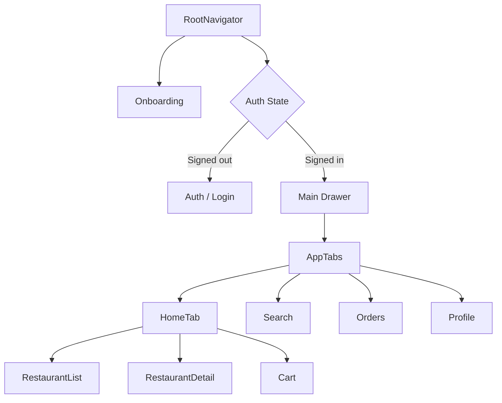

# Food Delivery App

A premium dark-theme food delivery app built with Expo, React Native, and React Navigation. The app focuses on a polished restaurant browsing experience with onboarding, auth, home discovery, restaurant detail, search, cart, orders, and profile screens.

## Features

- Modern dark UI with orange/red accent styling
- Onboarding and login flow with mock auth
- Restaurant browsing with featured cards and categories
- Restaurant detail experience with recommendations
- Search, cart, orders, and profile screens
- Drawer and tab-based navigation
- Reusable themed UI components

## Navigation Structure

The app uses a root stack, a drawer, bottom tabs, and a home stack:

- `RootNavigator`
  - `Onboarding`
  - `Auth` or `Main` depending on auth state
- `Main` drawer container
  - `AppTabs`
    - `HomeTab`
      - `RestaurantList`
      - `RestaurantDetail`
      - `Cart`
    - `Search`
    - `Orders`
    - `Profile`

### Navigation Flow

1. The app starts at `Onboarding`.
2. If the user is signed out, the app shows `Auth`.
3. If the user is signed in, the app shows `Main`.
4. `Main` contains the drawer and tabs.
5. `HomeTab` opens the restaurant list, restaurant details, and cart.
6. `Search`, `Orders`, and `Profile` are available from the bottom tabs.

## Diagram



## Setup

```bash
npm install
npm start
```


## Demo Video

Replace the placeholder with your final demo recording link.

- Demo video: [ demo video link](https://drive.google.com/file/d/1634jNkl9s6C05Rv9_PNOFGDLCM4t0rvD/view?usp=sharing)


## What Was Styled

- Onboarding screen with a premium hero section and CTA
- Login screen with polished inputs and buttons
- Home screen with featured content, chips, and restaurant cards
- Restaurant detail screen with a hero image and recommendation cards
- Search screen with empty states and result cards
- Cart screen with order summary and quantity UI
- Orders screen with progress/timeline styling
- Profile screen with account cards and menu rows

## Notes

- Authentication is mocked and persisted locally.
- The app uses deep linking with the `foodapp://` scheme.
- Reanimated is configured through the Expo-compatible Babel plugin.
